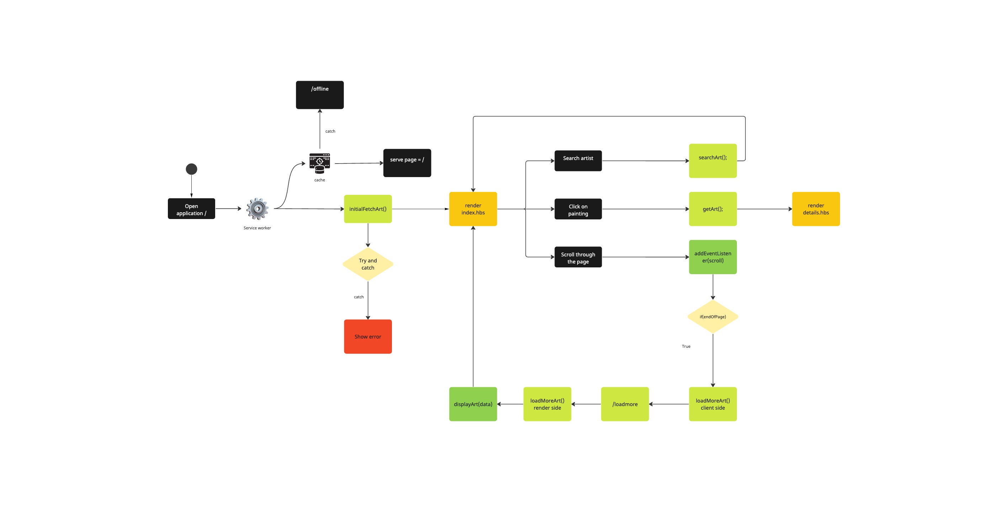

# Progressive Web Apps @cmda-minor-web 2022 - 2023

## Link to application :smile:
[Progressive application](https://progressive-web-app-production.up.railway.app/)

## Description :pen:
In this course we convert the client side web application, made during the Web App From Scratch course, into a server side rendered application. We also add functionalities based on the Service Worker and turn the application into a Progressive Web App. Finally we’ll implement a series of optimisations to improve the performance of the application.

## Goals
After finishing this program you can:

* deal with server side rendering;
* implement a Service Worker;
* enhance the critical render path for a better runtime or percieved performance.

## Checkpoint :smirk:
|Start screen| Details screen |
|---| --- |
|| 

### Functionality (Client side)
* Fetch a collection from the rijksmuseum API
* Display art in a gridlike structure
* Search functionality to search for paintings
* Routing system
* Details page to view a specific art 
* Infinite scrolling 

This is the current functionality I have created now I am tasked to convert this to server side

## Tools
|Node.js| NPM| Express |
| --- | --- |---|
|| |

### Node.js
Node.js is a free and open-source, cross-platform, back-end JavaScript runtime environment that allows developers to run JavaScript code outside of a web browser. It is built on Chrome's V8 JavaScript engine and provides an event-driven, non-blocking I/O model that makes it ideal for building scalable and high-performance applications. Node.js is commonly used for building web servers, real-time applications, and networking tools. It has a large and active community, with a vast ecosystem of third-party libraries and tools available for developers to use.

### NPM
NPM stands for Node Package Manager, and it is a command-line utility used to install, manage, and share Node.js packages.

Node.js is a popular JavaScript runtime environment that allows developers to run JavaScript code outside of a web browser, and it has a vast ecosystem of packages and modules that developers can use to build their applications. NPM provides a centralized repository of these packages, making it easy for developers to discover and install the dependencies they need for their projects.

In addition to managing packages, NPM also provides features for versioning and publishing packages, as well as tools for managing dependencies and scripts for building, testing, and deploying Node.js applications. NPM is an essential tool for Node.js developers, and it is included with every installation of Node.js.

### Express
Express.js is a popular and powerful web application framework for Node.js, designed to make it easy to build web applications and APIs. It provides a set of robust features and HTTP utility methods for creating RESTful API and handling HTTP requests and responses.

Express.js allows developers to create modular and scalable web applications, providing a flexible routing system that maps HTTP requests to corresponding application logic. It also offers middleware functionality, which allows developers to extend the core functionality of the framework and add additional features such as authentication and authorization, logging, error handling, and more.

Express.js is built on top of Node.js, so it takes advantage of Node's event-driven, non-blocking I/O model, making it highly efficient and performant. It is also widely adopted in the Node.js community and has a large ecosystem of plugins and extensions available.

|Handlebars| Sass |
|---|---|
||

in order to make development a litle bit easier I installed handlebars and sass

### Handlebars
Handlebars is a popular templating language that can be used with Node.js, as well as other JavaScript environments like web browsers. It allows you to dynamically generate HTML, or other markup, by filling in placeholders (called "variables") with data from a JavaScript object.

Handlebars templates consist of plain HTML, with special Handlebars tags that mark where variables or expressions should be inserted. For example, the `{{variableName}}` syntax is used to insert the value of a variable with the given name, while `{{#if expression}}` and `{{/if}}` are used to conditionally include or exclude blocks of HTML based on the value of an expression.

In Node.js, you can use the handlebars module to compile Handlebars templates into functions that can be called to render HTML dynamically, with data provided as input. This can be useful for generating dynamic web pages, sending email templates, or other tasks that involve generating HTML based on data.

### Sass
Sass (short for Syntactically Awesome Style Sheets) is a preprocessor scripting language that is used to create cascading style sheets (CSS). Sass is essentially an extension of CSS, providing a range of features and capabilities that are not available in CSS.

Sass allows you to use variables, mixins, nested rules, functions, and more to help make your CSS code more efficient and maintainable. For example, you can define a set of commonly used styles as a mixin, and then include that mixin in different parts of your code to apply those styles consistently. You can also use variables to define colors, font sizes, and other values, making it easy to update your styles across your entire site by updating a single variable.

Sass code is typically written in .scss or .sass files, which are then compiled into regular CSS code that can be used in a web application. There are several tools and frameworks available that can help you work with Sass, including Node.js-based command-line tools like Node-Sass and LibSass, as well as web-based Sass compilers like CodePen and SassMeister.

After installing all of the needed packages it was time to grind :moyai:

## Week 1
This week i focussed on setting up the node envirmont with tools described above.

In order to create a node environment I ran the command `npm init` to do so.
After that I created an app.js file and this is where all the core functionality will reside.

app.js

```javascript
import express from 'express';
import { engine } from 'express-handlebars';
import router from './routes/index.js';
import path from 'path';
import { fileURLToPath } from 'url';


const app = express();
const port = 3000;

const __filename = fileURLToPath(import.meta.url);
const __dirname = path.dirname(__filename);

app.engine('.hbs', engine({extname: '.hbs'}));
app.set('view engine', 'hbs');
app.set('views', './views');
app.use(express.static('public'));

app.use('/', router);


app.listen(port, () => {
    console.log(`Listening at http://localhost:${port}`)
});
```

After creating the core I decided to create some routes. In the code above you see that I used `app.use('/', router)` this file is being imported.

routes/index.js

```javascript
import express from 'express';
const router = express.Router();
import { initialFetchArt, getArt } from '../controllers/homeController.js';


router.get('/', initialFetchArt);
router.get('/art/:id', getArt);


export default router;
```

`router.get('/', initialFetchArt);`

The code above shows how I used router. Whats happening is that whenever I hit the route with `/` invoke the initialFetchArt. The initialFetchArt function is then again being imported from another file called HomeController.

HomeController.js.initialFetchArt

```javascript
const initialFetchArt = async (req, res) => {

    try{
        const response = await fetch(`${domain}?key=${apiKey}&p=${page}&ps=${limit}`);
        const {artObjects: data} = await response.json();

        const paintings = await Promise.all(data.map( async (painting) => {
            const smallImg = await getSmallerImg(painting.objectNumber);

            const newPainting = {
                ...painting,
                smallImg,
            };

            return newPainting;
        }));

        res.render('index', {
            paintings: paintings,
        });
    }catch(error){
        console.log(error);
    }
};
```

In the code above I do a simple fetch. The tricky part was using the spread operator. In order to improve the performance of the application I am calling a function `getSmallerImg` to get smaller images (the images in the collection are really big causing the application to run slower).

```javascript
const getSmallerImg = async(objectNumber) => {
    try{
        const smallerImg = await fetch(`${domain}${objectNumber}/tiles?key=${apiKey}`);
        const data = await smallerImg.json();
      
        const z4s = data.levels.filter(level => level.name == "z4");
        const z4 = z4s[0].tiles[0].url.replace("http", "https");
      
        return z4;
    }catch(error){
        return "https://rkd.nl/images/partners/rijksmuseum-logo.jpg";
    }
};
```
above is the function I am passing the objectNumber as parameter in order to fetch smaller images. Some paintings have no smaller image so for that I return a placeholder image.

This was kind of a tricky part

```javascript
const paintings = await Promise.all(data.map( async (painting) => {
    const smallImg = await getSmallerImg(painting.objectNumber);

    const newPainting = {
        ...painting,
        smallImg,
    };

    return newPainting;
}));
```

To quickly go over it I am creatig a new object and using the spread operator to insert the `smallImg` in the object. Then I can loop over the array with objects in my handlebars template.

```html
<ul>
    {{#each paintings}}
    <li class="loading">
        <a href="/art/{{objectNumber}}">
            
        </a>
    </li>
    {{/each}}
</ul>

```

In my layouts/main.hbs

```html
<!DOCTYPE html>
<html lang="en">
<head>
    <meta charset="UTF-8">
    <meta http-equiv="X-UA-Compatible" content="IE=edge">
    <meta name="viewport" content="width=device-width, initial-scale=1.0">
    <link rel="stylesheet" href="/css/app.css">
    <title>Rijksmuseum</title>
</head>
<body>
    <main>
        {{{body}}}
    </main>
</body>
</html>
```
and voila I did some more but I thought this was the most relevant pieces of code.

## Week 2

This week I focussed on converting some more parts of the application to node and trying to improve some bits of code

I first went ahead and implemented infinite scroll in my application. For that I used an combination of client side and server side to get it done.
First in my client side.

```javascript
window.addEventListener("scroll", () => {
    const endOfPage = window.innerHeight + window.scrollY >= document.body.offsetHeight - 500;
    
    if(endOfPage && !fired) {
      
        console.log("end of page");
        loadMoreArt();
        fired = true;
    }else if(!endOfPage){
      fired = false;
    }
  
  
});
```
A simple scroll event when the user has hit the bottom of the page this will invoke the function `loadMoreArt`
The `loadMoreArt` function send a request to the server side
```javascript
const loadMoreArt = async () => {
    loading = true;
    if(loading){

      const response = await fetch(url);
      const data = await response.json();

      displayArt(data);

      loading = false;

    }
}
```

In the server side I make an api call and send the response back to my client side.
```javascript
const loadMoreArt = async (req, res) => {
    page++;

    const response = await fetch(`${domain}?key=${apiKey}&p=${page}&ps=${limit}`);
    
    const {artObjects: data} = await response.json();

    const morePaintings = await Promise.all(data.map( async (painting) => {
        const smallImg = await getSmallerImg(painting.objectNumber);

        const newPainting = {
            ...painting,
            smallImg,
        };

        return newPainting;
    }));

    res.send(morePaintings)

};

```
Next in my client side I invoke the function `displayArt()` and this simply appends the html

```javascript
export const displayArt = async (paintings) => {


  paintings.forEach(painting => {
    var liHtml = `
    <li class="loading">
      <a href="/art/${painting.objectNumber}">
        
      </a>
    </li>`;
    container.insertAdjacentHTML("beforeend", liHtml);
    const lastLi = container.lastElementChild;

    setTimeout(() => {
      lastLi.classList.remove("loading");
      }, 400);
    
  });

};
```

and thats how the infinite scrolling is implemented :clap:.
If you are curious how I implemented more server side with client side you can also check out the search function.

### Manifest.json
Next I created an manifest.json but what is this?  `manifest.json` is a configuration file used in web applications and browser extensions to define various properties and features of the application or extension. It is a JSON file that provides information about the application or extension, such as its name, version, description, icons, permissions, background scripts, content scripts, and more.

In a web application, the manifest.json file is used to define the application's basic settings, such as its start URL, its display mode, and its icon. It can also be used to configure offline caching, push notifications, and other advanced features.

In a browser extension, the manifest.json file is used to define the extension's functionality, permissions, and settings. It can specify what pages the extension can access, what scripts it can run, what icons it should display, and what APIs it can use.

The manifest.json file is a critical part of both web applications and browser extensions, as it provides important information to the browser or platform on how to handle and display the application or extension.

```javascript
{
    "name": "Rijksmusuem Gallery",
    "version": "1.0",
    "description": "A simple web application to view the Rijksmuseum's collection",
    "icons": [
      {
          "src": "images/icons/icon-192x192.png",
          "sizes": "192x192",
          "type": "image/png"
      },
      {
          "src": "images/icons/icon-256x256.png",
          "sizes": "256x256",
          "type": "image/png"
      },
      {
          "src": "images/icons/icon-384x384.png",
          "sizes": "384x384",
          "type": "image/png"
      },
      {
          "src": "images/icons/icon-512x512.png",
          "sizes": "512x512",
          "type": "image/png"
      }
  ],
    "display": "standalone",
    "start_url": "/",
    "background_color": "#000000",
    "theme_color": "#454545",
    "short_name": "Rijksmusuem Gallery",
    "orientation": "portrait",
    "scope": "/"

}
```

### Service workers
The next task was to implement service workers in my application but what are service workers :eyes:.

Service Workers are JavaScript files that run in the background of a web application, independently of the web page, and provide additional functionalities such as caching, offline capabilities, and push notifications.

In other words, service workers act as a proxy between the web application and the network, intercepting requests and allowing for actions to be taken, such as serving cached data when a network connection is unavailable or pushing a notification to the user when a specific event occurs.

Service workers are event-driven and can be programmed to perform specific actions in response to events, such as intercepting requests, caching resources, updating the cache, and syncing data with the server when a network connection is available.

Service workers can enhance the performance of web applications by reducing the number of network requests and providing a better user experience by making the web application available offline or when network connectivity is poor.

The way you implement service workes goes as followed.

1. Register the service worker: The first step is to register the service worker by including the following code in your JavaScript file:

```javascript
if('serviceWorker' in navigator){
    window.addEventListener('load', () => {
        navigator.serviceWorker.register('../service-worker.js')
        .then(registration => {
            console.log('SW registered: ', registration);
        })
        .catch(error => {
            console.log('SW registration failed: ', error);
        })
    });
}
```
This code checks if the browser supports service workers and then registers it.

2. Install the service worker: Once the service worker is registered, the browser downloads the service worker file and installs it. This is done by adding an `install` event listener to the service worker file. The code inside this event listener is executed when the service worker is first installed.

```javascript
self.addEventListener('install', (e) => {
    console.log("Service Worker Installed");

    e.waitUntil(
        caches.open(CACHE_NAME)
            .then((cache) => {
                console.log("Service Worker Caching Files");
                cache.addAll(urlsToCache);
            })
            .then(() => self.skipWaiting())
    )
});
```

`urlsToCache` is an array of urls that the browser should catch.

```javascript
const urlsToCache = [
    '/',
    '/css/app.css',
    '/js/infiniteScroll.js',
    '/js/search.js',
];
```

3. Activate the service worker: After the service worker is installed, it needs to be activated. This is done by adding an `activate` event listener to the service worker file. The code inside this event listener is executed when the service worker is activated. This code deletes any old caches that are no longer needed.

```javascript
self.addEventListener('activate', (e) => {
    console.log("Service Worker Activated");

    e.waitUntil(
        caches.keys().then((cacheNames) => {
            return Promise.all(
                cacheNames.map((cache) => {
                    if(cache !== CACHE_NAME){
                        console.log("Service Worker Clearing Old Cache");
                        return caches.delete(cache);
                    }
                })
            );
        })
    );
});
```

4. Use the service worker: Once the service worker is registered, installed, and activated, it can be used to intercept network requests and perform actions such as caching and serving cached assets. This is done by adding an `fetch` event listener to the service worker file. The code inside this event listener is executed whenever a network request is made.

```javascript
self.addEventListener('fetch', function(event) {
  event.respondWith(
    caches.match(event.request).then(function(response) {
      if (response) {
        return response;
      }
      return fetch(event.request);
    })
  );
});
```

This are the basics on how to implement a service worker but I wanted to take it a step further but that is for next week stay tuned :smirk:

## Week 3
This week I wanted focus on improving the performance of my application and work some more with the service workers.

First I minified my css. For this I used sass.

I created different sass files to write my styling and import them all in `app.scss`

```css
@import 'grid';
@import 'details';
@import 'search';
@import 'error';
@import 'offline';
@import 'loading';
@import 'related';

```

Next I created a script in my packaga.json that minifies the css
```
 "scss": "sass --watch scss/app.scss public/css/app.css --style compressed",
```

This script takes whatever is in my `app.scss` and compiles it to css in `app.css`. After doing all this I am left with this.

```css
main ul{display:grid;grid-template-columns:1fr 1fr 1fr 1fr;grid-auto-rows:96px;gap:.1em;transition:.4s}main ul li{list-style:none;background-color:#454545;transition:transform 5s ease-in;transition:.8s;animation:fadein 1s;animation-fill-mode:forwards}main ul li a{display:flex;height:100%}main ul li:hover{transform:scale(1.2);transition:.2s;z-index:1}main ul li img{width:100%;height:100%;object-fit:cover;transition:.8s}@keyframes fadein{from{opacity:0}to{opacity:1}}main figure{height:50vh;position:relative}main figure img{width:100%;height:100%;object-fit:contain}main figure figcaption{position:absolute;bottom:0;left:0;width:100%;height:50%;background:linear-gradient(0deg, black, transparent);color:#fff;display:flex;justify-content:center;align-items:center;font-size:32px;font-weight:300;transition:.4s;font-family:"Octarine";padding:10px;font-family:fantasy}main h3{color:#fff;padding:10px;font-family:fantasy}main section.information{padding:10px;font-family:fantasy}main section.information p{font-size:1em;font-weight:100;color:#fff}form{position:fixed;width:90%;left:50%;bottom:32px;transform:translateX(-50%)}form input{width:45px;height:45px;border:none;border-radius:30px;padding:0 16px;font-size:12px;outline:none;background-color:#454545;color:#d0d0d0;transition:.4s}form input:focus{width:100%;aspect-ratio:0}section.error{width:100%;height:100vh;display:flex;justify-content:center;align-items:center}section.error div h2{font-weight:100;color:#fff}section.error div p{color:#fff;text-align:center}section.offline{height:100vh;display:flex;justify-content:center;align-items:center}section.offline h1{color:#fff;font-weight:100}div#loading{display:flex;justify-content:center;align-items:center;margin-top:20px}div#loading img{height:2.5em;width:2.5em}section.related h2{margin-bottom:20px;padding:10px;font-weight:100;color:#fff;font-family:fantasy}*{margin:0;padding:0;box-sizing:border-box}body{font-family:"Poppins",sans-serif;background-color:#000}body main{min-height:100vh}label{display:none}input[type=search]::-webkit-search-cancel-button{-webkit-appearance:none}main ul li:nth-of-type(1){grid-column:1/3;grid-row:1/3}main ul li:nth-of-type(4){grid-column:3/5}main ul li:nth-of-type(6){grid-row:3/5}main ul li:nth-of-type(13){grid-row:5/7}main ul li:nth-of-type(14){grid-row:5/7}main ul li:nth-of-type(15){grid-row:5/7}main ul li:nth-of-type(21){grid-column:1/3}main ul li:nth-of-type(22){grid-column:3/5}/*# sourceMappingURL=app.css.map */

```

all the scss is compiled to css and compressed benefits of this? Minification is the process of minimizing code and markup in your web pages and script files. It’s one of the main methods used to reduce load times and bandwidth usage on websites. Minification dramatically improves site speed and accessibility, directly translating into a better user experience. 

Next I looked at some of the images. The images in my application are quite big. If you scroll back to week 1 you see a function called `getSmallerImg(). What I basically did is to fetch smaller sized images to improve the performance further. Downside of this is that the images are a lil bit of a lower quality

`getSmallerImg()`
```javascript
const getSmallerImg = async(objectNumber) => {
    try{
        const smallerImg = await fetch(`${domain}${objectNumber}/tiles?key=${apiKey}`);
        const data = await smallerImg.json();
      
        const z4s = data.levels.filter(level => level.name == "z4");
        const z4 = z4s[0].tiles[0].url.replace("http", "https");
      
        return z4;
    }catch(error){
        return "https://rkd.nl/images/partners/rijksmuseum-logo.jpg";
    }
};
```

Next I worked a lil bit more on the service workers. At the time service workers was still a tricky concept to grasp but eventually I figured it out.

I started working on the fetch part of the service worker. What I wanted to implement was an offline page.

```javascript
self.addEventListener('fetch', (e) => {
    console.log("Service Worker Fetching", e.request.headers.get('accept'));
    // console.log(e.request);

    if(e.request.method == 'GET' && e.request.headers.get('accept').includes('text/html')){
        console.log("dit is een html get request", e.request.url)
        e.respondWith(

            caches.match(e.request.url)
            .then((response) => {
                return response || fetch(e.request.url)
            })
            .catch(() => caches.match('/offline'))
        );
    }else if(e.request.method == 'GET' && e.request.headers.get('accept').includes('image/*')){
        console.log('dit is een image request');
    }
    else if(e.request.method == 'GET' && e.request.headers.get('accept').includes('text/css')){
        console.log('dit is een css request');

        e.respondWith(
            caches.match(e.request)
            .then((response) => {
                return response || fetch(e.request);
            })
        );
    }
});
```

First I check whether the request is a GET request and if it is an html file

```javascript
 if(e.request.method == 'GET' && e.request.headers.get('accept').includes('text/html'))
```

If the condition is true I invoke the function `e.respondWith(). In this function I check whether the requested url matches the urls that are in my cache if it does simply fetch the page from the requested url. If something were to go wrong for example the requested url is not in the cache show me the offline page.

### Hurdles
 I also tried to use gulp to minify my javascript in order to boost the performance further but sadly I couldnt get it done on time.

 ### Activity Diagram
 |Activity diagram|
|---| 
|| 


